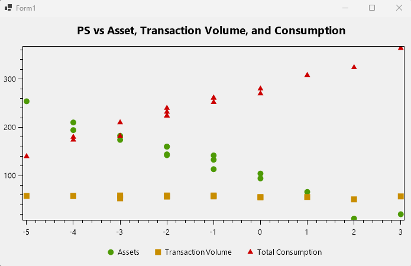

# Pricing Sensitivity Model

This project simulates a community of consumers, each with unique **Price Sensitivity (PS)** that affects their consumption behavior, wealth accumulation, and transaction volume. The goal of this model is to analyze how different price sensitivities influence consumers assets, total consumption, and transaction volume over time.

## Features

- **Consumers**: Each consumer has unique attributes: `PS`, `Asset`, `TransactionVolume`, and `TotalConsumption`.
- **Dynamic PS Generation**: Each consumer's PS is dynamically generated, affecting their consumption patterns.
- **Metrics**: The model tracks each consumer's:
  - **Assets**: Wealth accumulation over time.
  - **Total Consumption**: The total amount spent on consumption.
  - **Transaction Volume**: The number of transactions in which the consumer participates.
- **Visualization**: A simple OxyPlot scatter plot visualizes the relationship between **PS**, **Assets**, **Transaction Volume**, and **Total Consumption**.
  


## How the Model Works

1. **Consumers**: Consumers participate in transactions where they either consume or serve other consumers.
2. **PS Impact**: Each consumer's PS affects how much they consume and their ability to accumulate wealth.
3. **Simulation**: The simulation runs for a set number of iterations, and after each iteration, the model tracks the changes in each consumer's assets, consumption, and transaction volume.
4. **Results Visualization**: The results are displayed in a scatter plot that compares PS to the consumers' assets, transaction volume, and total consumption.

### Model Explained

In the context of this simulation, **Price Sensitivity (PS)** represents a numerical value assigned to each consumer that affects how they engage in transactions. It’s a simplified model of how consumers respond to prices or how aggressive their spending strategy is, which influences their consumption and wealth accumulation.

In real-world terms, **price sensitivity** could represent various behaviors, such as:

- **Reactiveness**: How sensitive a consumer is to price changes (i.e., will they spend more if prices rise or cut back?).
- **Consumption Preferences**: Some consumers may prefer luxury goods (higher PS values), while others prefer budget-friendly options (lower PS values).
- **Risk Appetite**: A high PS might indicate a consumer willing to spend more, even if it reduces their assets in the short term, expecting higher returns in the long run.

In this model, **PS** serves as a proxy for the consumer’s behavior when it comes to spending and saving. It impacts how much a consumer spends on consumption and, ultimately, how much wealth they accumulate.

### How Does PS Affect Consumers in the Model?

#### Higher PS Values (Positive):
- Consumers with **higher PS values** tend to **spend more** on consumption in each transaction.
- **Total consumption** increases as PS rises, which results in **lower net assets** because the consumer is spending more than they might be earning in transactions.
- High PS could represent consumers who adopt a more **aggressive spending strategy**, perhaps valuing luxury or convenience over saving.

#### Lower PS Values (Negative):
- Consumers with **lower PS values** tend to **spend less** on consumption.
- These consumers tend to **accumulate more wealth** over time because they aren’t spending as aggressively.
- Low PS could represent consumers with a more **frugal or conservative spending approach**, prioritizing savings over immediate consumption.

### How PS Impacts Consumer Behavior in the Simulation:

#### Consumption:
The consumer’s **total consumption** in each round is calculated as:
```csharp
consumption = transactionPrice + PS; 

```

### How to Run the Model

To run this simulation locally, follow these steps:

1. Clone the repository from GitHub:
   ```bash
   git clone https://github.com/xqyet/macroeconomic-PSModel.git
   ```
   ### Contributions
   This .NET WinFormsApp was created using C# in Visual Studio by me. Feel free to fork and adjust variables to expand the model or focus on a specific part of the simulation!
